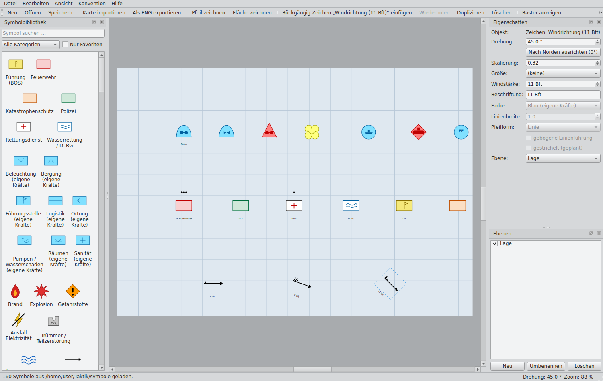

# Taktik – Taktische Lagekarte

Plattformübergreifendes Python-Desktop-Tool zur Darstellung und Bearbeitung
taktischer Lagen auf Karten nach Bundeswehr- und THW-Konventionen.



## Funktionen

- **Kartenimport**: PNG, JPG/JPEG, TIFF (Raster) und SVG (Vektor)
- **Nordausrichtung**: nicht-destruktive Drehung mit Gradanzeige;
  die Originaldatei bleibt unverändert
- **Symbolbibliothek**: liest taktische Zeichen (PNG/SVG) aus einem frei
  wählbaren Ordner, optionale JSON-Metadaten, Kategorien, Suchfeld, Favoriten
- **Mitgelieferter Symbolsatz**: programmatisch erzeugte APP-6-Zeichen
  (`symbole/`), erweiterbar über `python -m taktik.symbols.generator`
- **Größenkennzeichnungen**: vollständige NATO-APP-6-Echelon-Leiter
  (Trupp Ø · Gruppe ● · Staffel ●● · Zug ●●● · Kompanie I · Bataillon II ·
  Regiment III · Brigade X · Division XX · Korps XXX · Armee XXXX ·
  Heeresgruppe XXXXX · Theater XXXXXX), automatisch mittig über dem
  Zeichen ergänzt; Konventionssätze **Bundeswehr (APP-6)** und **THW/BOS**
  im Menü umschaltbar
- **Bearbeitung**: verschieben (Maus/Drag-and-Drop), drehen, skalieren,
  löschen, duplizieren, beschriften – mit Undo/Redo
- **Pfeile**: Bewegungs-/Angriffsrichtungen einzeichnen (Werkzeug „Pfeil
  zeichnen“, Taste `P`): Punkte anklicken oder in einem Zug ziehen,
  Doppelklick/Rechtsklick/Enter schließt ab; Mehrpunkt-Verlauf, gebogene
  Linienführung, breiter Umrisspfeil (Angriffsrichtung), alle Stützpunkte
  einzeln verschiebbar; Farbe, Linienbreite, Strichelung, Beschriftung
- **Linien**: eigenständiges Werkzeug „Linie zeichnen" (Taste `L`) für
  Routen, Grenzen und Sperren – ohne Pfeilspitze, mehrpunktig; wählbare
  Muster **glatt**, **Zinnen** (Kastenmuster für Stellungen/Grenzen),
  **Welle**, **Striche oben/unten** (Querstriche, Teilung 1:1) und
  **Igel** (T-Striche); Pfeilspitze und Muster jederzeit im Eigenschaftenfenster
  umschaltbar (Pfeile und Linien teilen sich dieselbe Objektart)
- **Flächen**: Einsatzabschnitte/Schadensgebiete als Polygon einzeichnen
  (Werkzeug „Fläche zeichnen“, Taste `F`) mit transparenter Füllung,
  gestrichelter Begrenzung und zentrierter Beschriftung
- **Ereignissymbole**: Brand, Explosion, Überschwemmung, Trümmer,
  Gefahrstoffe, Stromausfall – durchgestrichener Blitz
  (`symbole/ereignisse/`) sowie THW-Fachzeichen (Bergung, Ortung,
  Räumen, Pumpen, Beleuchtung)
- **Windrichtungspfeile mit Windstärke**: meteorologische Fiedern
  (halbe Fieder ≈ 5 kn, ganze ≈ 10 kn, Wimpel ≈ 50 kn) für 1–12 Bft;
  die Stärke ist im Eigenschaftenfenster umschaltbar, die Richtung
  über die Drehung
- **Luft- und Seefahrzeuge**: Kampfflugzeug, Bomber,
  Transportflugzeug, Hubschrauber, UAV (unten offener Bogenrahmen)
  sowie Flugzeugträger, Kriegsschiff, Kreuzer, Zerstörer, Fregatte,
  U-Boot, Boot (Kreisrahmen) je Zugehörigkeit
- **BOS-Einheiten und -Fahrzeuge**: Feuerwehr (rot), Polizei (grün),
  Rettungsdienst (weißes Kreuz mit rotem Rahmen), Wasserrettung/DLRG,
  Führung (gelb), Katastrophenschutz (orange), SEG (auch Verpflegung
  und Drohne) sowie die Fahrzeuge LF, TLF, HLF, DLK, GW, MTW, RTW,
  KTW, NEF und ELW im Kfz-Grundzeichen (Rechteck mit gewölbter
  Unterseite) nach DV-102-Farbgebung (`symbole/BOS/`)
- **Ebenen**: anlegen, umbenennen, ein-/ausblenden, per Drag-and-Drop
  sortieren (oberste Ebene liegt vorn)
- **Raster & Fangfunktion**, Zoom (Mausrad) und Pan (mittlere Maustaste)
- **Speicherung**: natives Projektformat `.taktik` (ZIP-Container mit
  `project.json` und eingebetteten Assets – selbsttragend und portabel)
- **Export**: PNG (2×-Auflösung) und SVG; Druckfunktion
- **Tutorial**: geführter Einstieg mit dem Guide „Safety" (beim ersten
  Start und jederzeit über „Hilfe → Tutorial")
- Deutschsprachige Oberfläche, offline nutzbar

## Installation

```bash
pip install -r requirements.txt
```

Benötigt Python ≥ 3.10 und PySide6 ≥ 6.6.

## Start

```bash
python -m taktik
```

Optional mit Projektdatei: `python -m taktik lage.taktik`

Beim ersten Start wird automatisch der mitgelieferte Symbolordner
`symbole/` geladen; über *Datei → Symbolordner öffnen…* kann jederzeit ein
eigenes Verzeichnis gewählt werden.

## Symbolordner-Struktur

```
symbole/
├── BOS/
├── ereignisse/
├── fuehrung/
├── infanterie/
├── logistik/
├── luft/
├── sanitaet/
├── see/
└── THW/
```

Optionale Metadaten je Symbol (`<name>.json` neben `<name>.svg/.png`):

```json
{
  "name": "Führungsstelle",
  "kategorie": "Führung",
  "standardgroesse": "Zug"
}
```

## Architektur

Modulare Trennung von UI, Kartenlogik und Symbolverwaltung:

```
taktik/
├── core/          # Qt-freies Datenmodell + .taktik-Projektformat (ZIP)
│   ├── model.py
│   └── project_io.py
├── symbols/       # Qt-freie Symbolverwaltung
│   ├── library.py     # Ordner-Scan, Metadaten, Suche, Favoriten
│   ├── generator.py   # APP-6-SVG-Generator (Startersatz)
│   └── echelon.py     # Größenkennzeichnungen BW / THW (datengetrieben)
└── ui/            # PySide6-Oberfläche
    ├── main_window.py # Menü, Werkzeugleiste, Docks
    ├── scene.py       # Szene: Modell ↔ QGraphicsItems, Raster/Fang
    ├── map_view.py    # Kartenansicht: Zoom, Pan, Drag-and-Drop
    ├── items.py       # Karten-/Symbol-Items, Echelon-Rendering
    ├── commands.py    # Undo/Redo-Kommandos
    ├── symbol_panel.py, properties_panel.py, layers_panel.py
    └── export.py      # PNG-/SVG-Export, Druck
```
